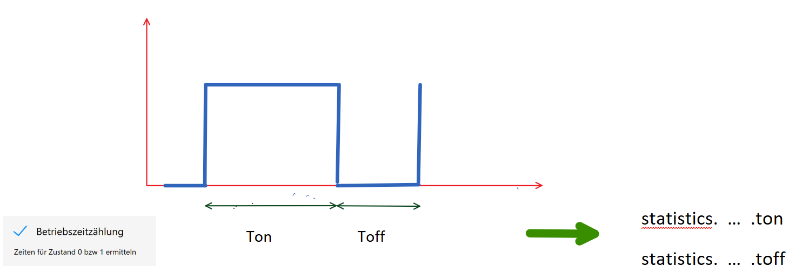
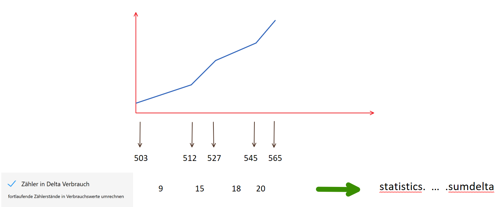

# Wie konfiguriere ich statistics?

Der Adapter speichert für jedes aktive Objekt die Werte temporär in statistics.0.temp für die fortlaufende Bewertung.
Zu vorgegebenen Zeiten (Tag, Woche, Monat, Quartal, Jahr) erfolgt die Übernahme der temporären Werte in die Struktur statistics.0.save.

Für bestimmte Werte sind auch 5min Zwischenwerte ermittelt, wie es z.B. bei den 433MHz Steckdosen von ELV der Fall ist, die einen Verbrauchswert alle 5min übermitteln.

## Impulse

Stellt das binäre Objekt eine Impulsfolge dar, die z.B. aus Zählerimpulsen entsteht, so ist hier das Prinzip dargestellt:

Der Adapter zählt die Impulse und es wird mit einer Zählerkonstanten multipliziert.
So ergibt sich aus den 0/1 Wechseln eine analoge Größe, die auch dann im Adapter sofort weiter benutzt werden kann (z.B. für Summendelta)
Die sich ergebende Analoggröße ist eine stetig steigende.

## Binärzustände

Stellt das binäre Objekt Schalzustände dar, so kann daraus die Zeit für den Zustand mit logisch 1 und die Zeit mit logisch 0 ermittelt werden.
Diese Betriebszeitzählung sollte nicht auf Impulse aus Zählern angewendet werden.

## Analogwerte

Grundsätzlich wir das Minimum Maximum und der Durchschnitt ermittelt.
Der Durchschnitt ist der arithmetische Mittelwert.

Für einen fortlaufenden Verbrauchswert wie er bei der Energiezählung entsteht kann man eine Delta ermitteln um die Verbräuche je Zeiteinheit darzustellen. 
Dies kann auch auf Verbräuche angewendet werden, die aus Impulszählung entstehen.

